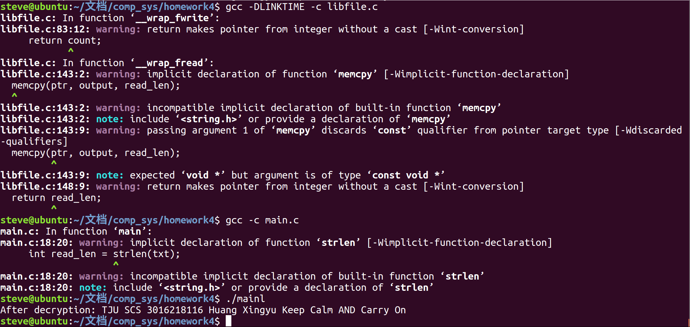
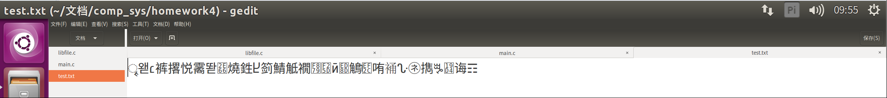
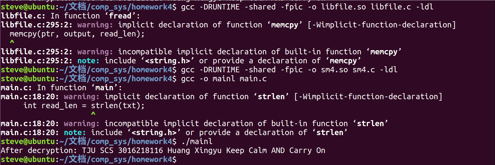
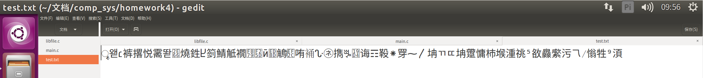

# SM4-ECB-Encryption-and-Decryption

The project aims to use run-time and link-time interpositioning technology to achieve SM4 ECB encryption and decryption for file reading and writing.

## Link-time Interpositioning

To apply SM4 ECB Encryption and Decryption using link-time interpositioning, I wrote libfile_linktime.c. And the file is fully commented.

### Screenshot to verify link-time interpositioning

As shown above, the decrypted data is the same as the file to be written, the implementation is verified. And the encrypted data is written as below.

## Run-time Interpositioning

To apply SM4 ECB Encryption and Decryption using run-time interpositioning, I wrote libfile_runtime.c. As most of the implementation if the same as link-time interpositioning, the file is not commented.

### Screenshot to verify run-time interpositioning

As shown above, the decrypted data is the same as the file to be written, the implementation is verified. And the encrypted data is written as below.

As shown above, the encrypted data still remains.